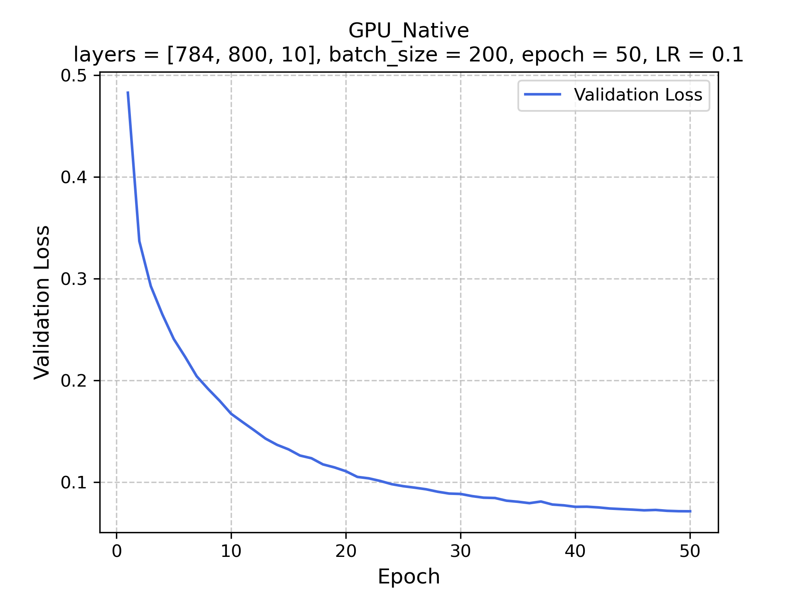
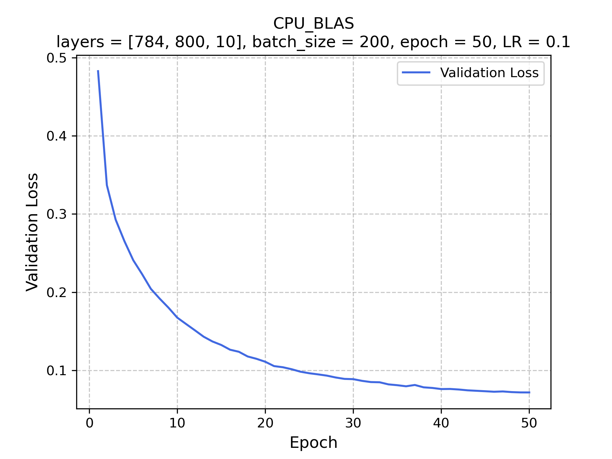

# Project 3 Final

Dikshant Pratap Singh

dikshant@uchicago.edu

## Code Structure and Implementation

The implementation is achieved through a single `nn.cu` file. The program takes the input of the various parameters from the CLI and then runs the algorithm as specified in the problem. The CLI inputs can be used to specify the runtype, CPU or GPU, and, native or BLAS (CuBLAS for GPU). Details if this can be found in the running the code section. Brief overview of the code structure:

1. Take the input from the CLI and check if the number of arguments provided is correct. Input the data into the program, specifically the training images, training labels, test images and test labels. Take the last 10k images and labels of training as the validation set.
2. Make the arrays for layer dimensions, layer values, z values for the neural network. Allocate and initialize the weights and biases.
3. Malloc all the data that will be required for the training and testing, both for CPU and GPU.
4. Start the training with min batch gradient descent. The code calls the required subroutine based on the input parameters, whether to use blas, cublas, native cpu or native gpu. Once a batch is is done, the weights are updated using the provided learning rate
5. At the end of each epoch, the program prints out the validaion loss based on the last 10k images of training set (used for validation). Also it prints out the test and train accuracies.
6. In the end print the final test and train accuracies. Free all allocated memory.

## Running the code

* Run `module load cuda openblas` and then `make bench` to reproduce the result table given below.
* To run the code manually, compile the code using `make` and then run the following:
```console
$ ./nn <nl> <nh> <ne> <nb> <alpha> <no_BLAS> <use_GPU> <print_accuracy> <print_validation_loss>
```

Parameters:
 
* `nh`: number of hidden layers apart from input and output
* `nh`: number of nodes in hidden layers
* `ne`: number of epochs
* `nb`: batch size
* `no_BLAS`: whether to use BLAS (or CuBLAS) or not (Default: `0`, means uses native)
* `use_GPU`: whether to use GPU or CPU. (Default: `0`, uses CPU)
* `print_accuracy`: If set to `1` prints test and train accuracy at each epoch, default 0. WARNING: makes program very slow.
* `print_validation_loss`: If set to `1` prints validation loss at each epoch, default 0. WARNING: makes program very slow.

## Observations

* For CPU, BLAS implementation was much faster than native. However for GPU, the CuBLAS implementation was only marginally faster than native. My implementation of native GPU computation computed each element of the resultant matrix product seperately. Maybe there isin't much more there for CuBlas than that.
* CuBLAS v1 gave faster results than CuBLAS v2.
* All type of implementations gave the exact same validation loss plot for the same seed which is as expected
* Randomization using different seed values does not effect the final accuracy after 50 epochs by condiserably. Apart form some different loss trends, in the end they all reach the same level of accuracy.


|      Seed     | 1      | 2      | 4      | 8      | 16     | 32     | 64     | 128    | 256    | 512    | 1024   | 2048   |
|---------------|--------|--------|--------|--------|--------|--------|--------|--------|--------|--------|--------|--------|
| Train Accuracy| 99.08% | 99.10% | 99.15% | 99.09% | 99.10% | 99.12% | 99.08% | 99.10% | 99.08% | 99.12% | 99.12% | 99.05% |
| Test Accuracy | 97.80% | 97.85% | 97.88% | 97.78% | 97.80% | 97.87% | 97.75% | 97.71% | 97.85% | 97.81% | 97.76% | 97.70% |


## Results

* Model: 784 (input) -> 800 -> 10 (output). All layers use `relu` activation except output layer which uses `softmax`
    
* Common Parameters:
    * Learning rate: `0.1`
    * Epochs: `50`
    * Kaiming Initialization
    * Normalized Input
    * Single Precision


|   Version  |    Processor    | Train Accuracy | Test Accuracy | Grind Rate (imgs/sec) | Training Time (sec) | TPB/cores |
|:----------:|:---------------:|:--------------:|:-------------:|:---------------------:|:-------------------:|:---------:|
| GPU native |       V100      |     99.09 %    |    97.79 %    |        45285.55       |        60.57        |    256    |
| GPU CuBLAS |       V100      |     99.09 %    |    97.79 %    |        50458.84       |        56.12        |    256    |
| CPU native | Xeon Gold 6248R |     99.09 %    |    97.79 %    |         726.54        |       3442.50       |     1     |
|  CPU BLAS  | Xeon Gold 6248R |     99.09 %    |    97.79 %    |        20517.16       |        126.91       |     1     |


<table style="width: 100%; border-collapse: collapse;">
    <tr>
        <td style="padding: 10px; border: 1px solid #ccc; text-align: center;"></td>
        <td style="padding: 10px; border: 1px solid #ccc; text-align: center;"></td>
    </tr>
    <tr>
        <td style="padding: 10px; border: 1px solid #ccc; text-align: center;"></td>
        <td style="padding: 10px; border: 1px solid #ccc; text-align: center;"></td>
    </tr>
</table>
